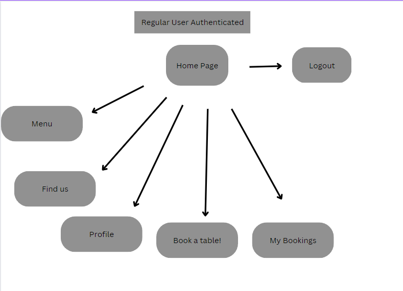
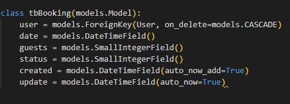

# **[Au Revoir Bistrot](#)**  French Restaurant

## **Overview**

Au Revoir Bistrot is a website for a fictional restaurant developed for lurning purposes. The restaurant is located in the center of Paris and offers classic French food.

Developed by Martin Fortuna

## **Project Goals**

As part of my journey as a student of Code Institute, the goal of this project is to demonstrate how I can apply my Bootstrap, Python & Django skills. I've built a fully friendly UX by not using the default built-in Django admin panel for the admin user.

## **User Goals**

-  Login, log-out, and sign-up feature.
-  CRUD feature for regular/admin users.
-  Ability to accept or deny bookings for admin users.
-  Contact Us Page.
-  Easy to read the menu.

## **Agile methodology**

The development phase was applied with Agile methodologies to deliver small features with efficiency and maintain hypothetical business value. User stories were prioritized according to the MoSCoW method to deliver the primarily needed functionalities first.

[Project Kanban](https://github.com/users/MartinFortuna/projects/6/views/1)

### **User stories**

- A - As a developer I can correctly set up the basic project as in CI walkthrough so that all the basis is set to start development. 
- B - As a user, I can view the website on different devices so that I can access it anytime.
- C - As a user, I can register,login or logout  on the website so that I can access the  reservations feature.
- D - As a regular user, I can create, view or cancel my reservation so that I can change plans.
- E - As a user, I can choose to view, edit and delete my profile so that correct and erase my information.
- F - As an admin user, I can choose to accept or deny reservation requests so that I do not overbook my restaurant.
- G - As an admin user, I can view, edit or delete my customer list/profile so that manage the customers profiles.
- H - As a developer, I can avoid double bookings so that the restaurant is not spammed.
- I - As a user, I can view a simplistic menu so that I can easily understand the options.
- J - As a user, I can find opening hours and contact information so that I contact the restaurant within business hours.
- K - As a user, I can contact the restaurant by email so that I do not have to call. 
- L - As a developer, I can create a custom 404 page so that the customer has a link to return to the home page.
- M - As a user, I can leave a review so that I can share my experience. 

### **Story Points**

The current capacity is 20 story points per iteration.

- Iteration one : 

 User story ID | Story Point | MoSCoW categorization |
| ---------- |  -----------| ---------- |
| A | 2 | Must-Have |
| B | 2 | Must-Have |
| C | 2 | Must-Have |
| D | 2 | Must-Have |
| E | 2 | Must-Have|
| F | 2 | Must-Have |
| G | 2 | Should-Have |
| H | 0 | Won't-Have |
| I | 2 | Should-Have |
| J | 2 | Should-Have |
| K | 1 | Could-Have |
| L | 2 | Should-Have |
| M | 1 | Could-Have |

Scores:

- Must-Have: 12 story points
- Should-Have: 8 story points
- Could-Have: 2 story points
- Won't-Have: 0 story points

## **Design**

The website is fully responsive and designed with an easy access hamburger menu to make nagivation intuitive, the login button button will be replaced by a login icon so that the device stays reponsive on very small screens. 
As for the colors, I decided to use Bootstrap's dark background along with it's warning yellow across the website for consistency and pleasing colors. [ Au revoir Bistrot colors](docs/screenshots/colors.png)

### App structure: 

- Non authenticated user Flow:

- Authenticated user Flow:

### Wireframes: 

|    Desktop   |    Tablet    |    Mobile    |
|    :----:    |     :----:   |    :----:    |
|[Home Page](docs/screenshots/hompageDesktop.png)|[Home Page](docs/screenshots/homepageIpad.png)|[Home Page](docs/screenshots/homepageMobile.png)|
|[Login](docs/screenshots/loginDesktop.png)|[Same as Desktop](docs/screenshots/loginDesktop.png)|[Same as Desktop](docs/screenshots/loginDesktop.png)|
|[Register](docs/screenshots/Sign-up.png)|[Same as Desktop](docs/screenshots/Sign-up.png)|[Same as Desktop](docs/screenshots/Sign-up.png)|
|[Menu](docs/screenshots/menuDesktop.png)|[Menu](docs/screenshots/menuIpad.png)|[Menu](docs/screenshots/menuMobile.png)|
|[Find us](docs/screenshots/findusDesktop.png)|[Find us](docs/screenshots/findusIpad.png)|[Find us](docs/screenshots/findusMobile.png)|
|[Booking Requests](docs/screenshots/bookingrequestsDesktop.png)|[Same as Desktop](docs//bookingrequestsDesktop.png)|[Same as Desktop](docs/screenshots/bookingrequestsDesktop.png)|
|[Customer List](docs/screenshots/customerlist.png)|[Same as Desktop](docs/screenshots/customerlist.png)|[Same as Desktop](docs/screenshots/customerlist.png)|
|[Profile](docs/screenshots/regularuserprofile.png)|[Same as Desktop](docs/screenshots/regularuserprofile.png)|[Same as Desktop](docs/screenshots/regularuserprofile.png)|
|[Book a table](docs/screenshots/bookatableDesktop.png)|[Same as Desktop](docs/screenshots/bookatableDesktop.png)|[Same as Desktop](docs/screenshots/bookatableDesktop.png)|
|[My Bookings](docs/screenshots/mybookindsDesktop.png)|[Same as Desktop](docs/screenshots/mybookindsDesktop.png)|[Same as Desktop](docs/screenshots/mybookindsDesktop.png)|

### Data Model: 

## **Features**

### Existing Features: 

- Well layed out home page with pleasing colors.
- Hamburger navigation across all devices for easy navigation.
- Login icon and registration button that transform into logout button once user is authenticated.
- Role-based login and current login state is reflected to the user.
- Users are not permitted to access restricted content or functionality prior to role-based login.
- Create, read and edit funcionality for reservations on regular user UX.
- View, edit, and delete Profile functionality for regular users.
- Better admin user UX with using Django's admin interface, also for consistency.
- Accept or deny booking requests funcionality on admin user UX.
- Edit and delete functionality for Profile on regular user UX.
- Reservation request status(pending, accepted, rejected).
- Nav bar links that change according to user type authentication.
- Contact page with opening hours, send email funcionality and contact details.
- Menu page.
- Footer with social media links.
- Custom 404 page.

###  Features that can be implemented:

- Sorting reservations(per date, time) on admin view.
- Google maps in contact page.
- Booking and resgistration  confirmation email.
- Map of restaurant and occupancies according to reservations made and vacancy.
- Creation of reservation on the admin side.

## **Technologies**

### Languages Used

- [HTML5](https://en.wikipedia.org/wiki/HTML5)
- [Bootstrap](https://getbootstrap.com)
- [CSS3](https://en.wikipedia.org/wiki/Cascading_Style_Sheets)
- [Python](https://www.python.org/)
- [Django](https://www.djangoproject.com/)
- [Javascript](https://en.wikipedia.org/wiki/JavaScript)

### Frameworks and Tools Used

1. [Google Fonts](https://fonts.google.com/) - Used for applying Oswald and sans-serif fonts.
1. [Font Awesome](https://fontawesome.com/)- User for social media icons.
1. [Coolors](https://coolors.co/) - Used to design colors palette. 
1. [Balsamiq](https://balsamiq.com/) - Used for wireframes.
1. [Stackoverflow](https://stackoverflow.com/) - For general coding questions.
1. [W3schools](https://www.w3schools.com/) -  For general coding questions.
1. [W3C HTML Validator](https://validator.w3.org/) - Used to validate all HTML pages.
1. [W3C JigSaw Validator](https://jigsaw.w3.org/css-validator/) - Used to validate CSSS.
1. [JSHint](https://jshint.com/) - Used to validate Javascript.
1. [CI Python Linter](https://pep8ci.herokuapp.com/) - Used to validate Python.
1. [Grammarly](https://www.grammarly.com/) - Used for spelling mistakes correction.s
1. [Favicon.io](https://favicon.io/) - Used to create the favicon.
1. [Freelogodesign](https://www.freelogodesign.org/) - Used to create the logo.
1. [GitHub:](https://github.com/) - Used for version control and storage.

## **Testing**

### Validators

### Manual testing was font on a separate file: 

## **Deployment**

### **Gitpod**

This project was created based on CI's template, I used Cloudinary for images and MyElephantSQL for the database.

### **Clone Repo**

Close the repository so that you can recreate the app by:

1. Going to  https://github.com/MartinFortuna/mrw-restaurant
2. Click the green Code dropdown arrow and select open with(choose your IDE)

### **Final Deployment with Heroku**

1. [Heroku](https://dashboard.heroku.com/apps) and create a new app.
2. Choose the app name and setting the region, then "Create app".
3. On"Settings" go to Config Vars, and set:
    - SECRET_KEY
    - DATABASE_URL
    - CLOUNDINARY_URL
    - PORT: 8000(Your build might fail if not entered)
4. Deploy.

# **Acknowledgments** 

To my friends Guillerme and Juliana, the biggest thanks I can give for all the mentoring provided.

